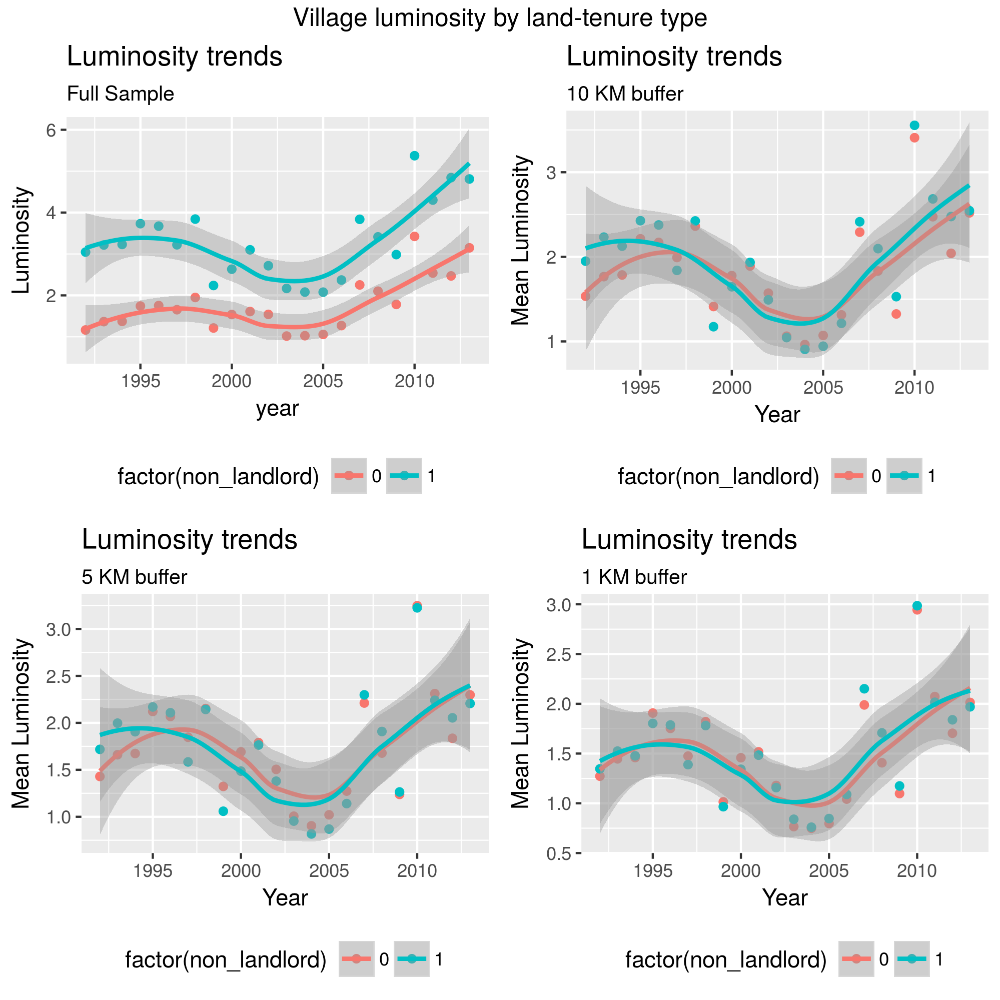

\newpage

# Overview

Introduce paper

# Pandoc incantations

configure sublime build systems for these so that `ctrl+b` builds the
file

## Markdown to pdf

`pandoc -o $file_base_name.pdf -s $paper.md --filter=pandoc-citeproc`

## Markdown to tex (to fiddle with tex settings / packages)

`pandoc -o $file_base_name.tex -s $paper.md --filter=pandoc-citeproc`

# Pandoc Markdown incantations

## Citations

cite a paper (@ManningHealthinsurancedemand1987) by using `(@citekey)
syntax`.

## Footnotes

Here is a footnote reference,[^1] and[^2] another.[^longnote]. Inline
footnotes are easier to handle^[like so].

[^1]: Footnotes are the mind killer. Footnotes are the little-death
    that brings total obliteration. I will face my footnotes.

[^2]: Here is the 2nd footnote.

[^longnote]: Here's one with multiple blocks.

    Subsequent paragraphs are indented to show that they
belong to the previous footnote.

        { some.code }

    The whole paragraph can be indented, or just the first
    line.  In this way, multi-paragraph footnotes work like
    multi-paragraph list items.

This paragraph won't be part of the note, because it
isn't indented.

## Images

to import images:
``

\newpage

# Empirics

## Estimation output embedding

**latex input command for estimation output** `\input{texfile.tex}`

\vspace{5mm}
\input{table4d.tex}
\vspace{5mm}

blah blah blah

# Conclusion

blah blah

\newpage

# Bibliography
